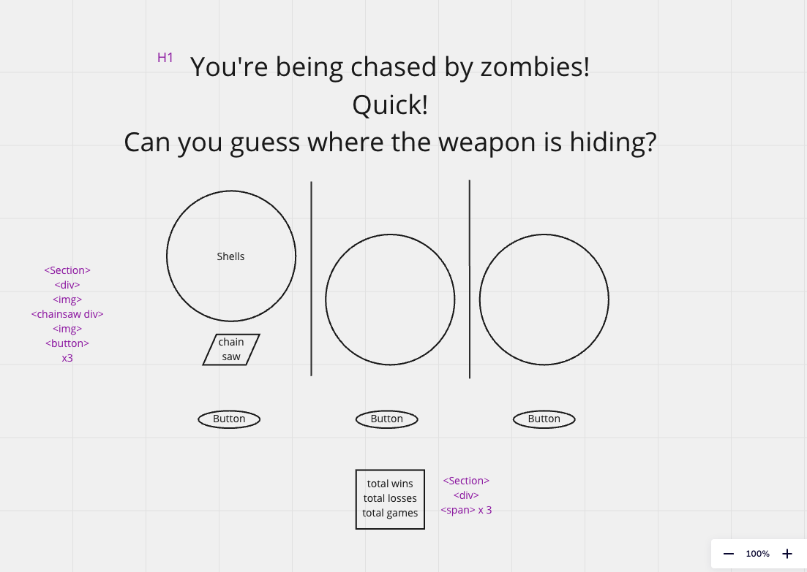

# State

total wins 
total losses 
total games 

## Events

click of button 
-increment total 
-generate random location for chainsaw 
-reveal chainsaw if user guessed correctly 
 
shells move up 
chainsaw is shown 
